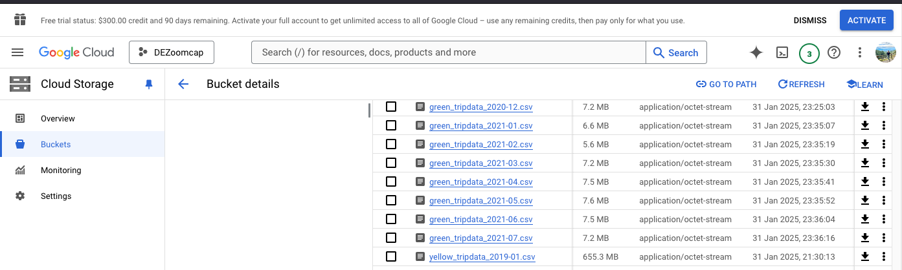
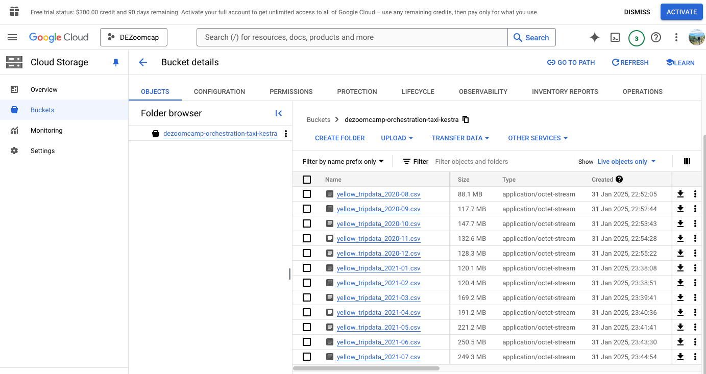
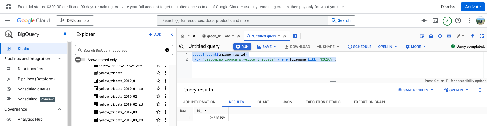
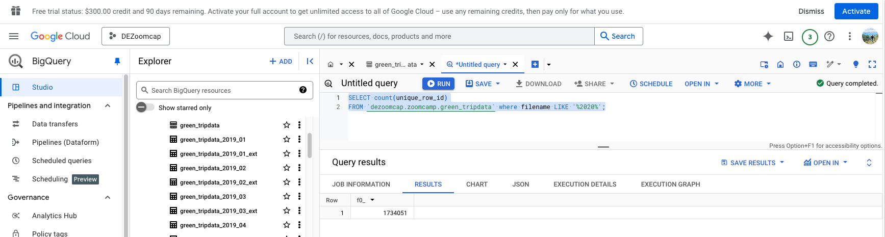
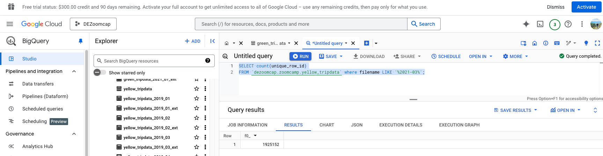

## Module 2 Homework

ATTENTION: At the end of the submission form, you will be required to include a link to your GitHub repository or other public code-hosting site. This repository should contain your code for solving the homework. If your solution includes code that is not in file format, please include these directly in the README file of your repository.

### Assignment

So far in the course, we processed data for the year 2019 and 2020. Your task is to extend the existing flows to include data for the year 2021.

Green Taxi Data for 2021:

Yellow Taxi Data for 2021

### Quiz Questions

Complete the Quiz shown below. It’s a set of 6 multiple-choice questions to test your understanding of workflow orchestration, Kestra and ETL pipelines for data lakes and warehouses.

1) Within the execution for `Yellow` Taxi data for the year `2020` and month `12`: what is the uncompressed file size (i.e. the output file `yellow_tripdata_2020-12.csv` of the `extract` task)?
- 128.3 MB
- 134.5 MB
- 364.7 MB
- 692.6 MB

Answer: 128.3 MB as per above screenshot

2) What is the value of the variable `file` when the inputs `taxi` is set to `green`, `year` is set to `2020`, and `month` is set to `04` during execution?
- `{{inputs.taxi}}_tripdata_{{inputs.year}}-{{inputs.month}}.csv` 
- `green_tripdata_2020-04.csv`
- `green_tripdata_04_2020.csv`
- `green_tripdata_2020.csv`

Answer:  `green_tripdata_2020-04.csv' 

3) How many rows are there for the `Yellow` Taxi data for the year 2020?
- 13,537.299
- 24,648,499
- 18,324,219
- 29,430,127

Answer: 24,648,499

4) How many rows are there for the `Green` Taxi data for the year 2020?
- 5,327,301
- 936,199
- 1,734,051
- 1,342,034

Answer: 1,724,051

5) How many rows are there for the `Yellow` Taxi data for March 2021?
- 1,428,092
- 706,911
- 1,925,152
- 2,561,031

Answer: 1,925,152

6) How would you configure the timezone to New York in a Schedule trigger?
- Add a `timezone` property set to `EST` in the `Schedule` trigger configuration  
- Add a `timezone` property set to `America/New_York` in the `Schedule` trigger configuration
- Add a `timezone` property set to `UTC-5` in the `Schedule` trigger configuration
- Add a `location` property set to `New_York` in the `Schedule` trigger configuration  

ANSWER: Add a `timezone` property set to `America/New_York` in the `Schedule` trigger configuration

## Submitting the solutions

* Form for submitting: https://courses.datatalks.club/de-zoomcamp-2025/homework/hw2
* Check the link above to see the due date

## Solution

Will be added after the due date
